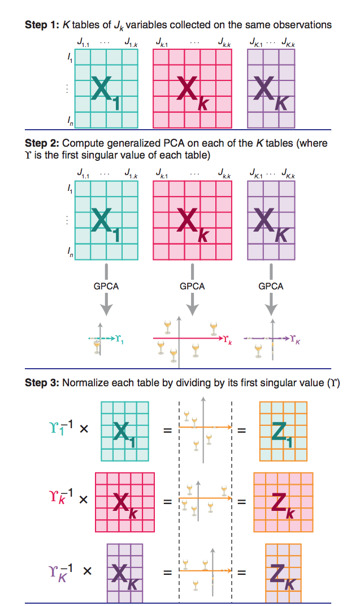
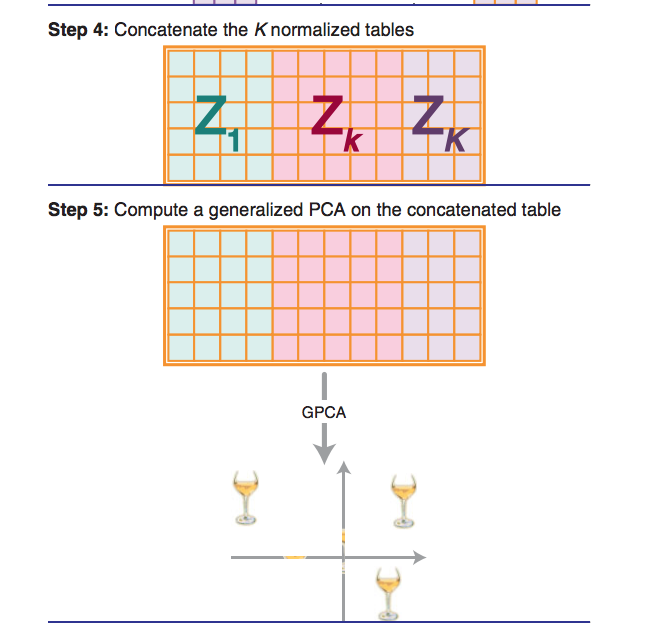
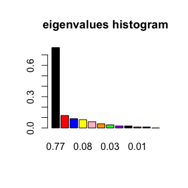
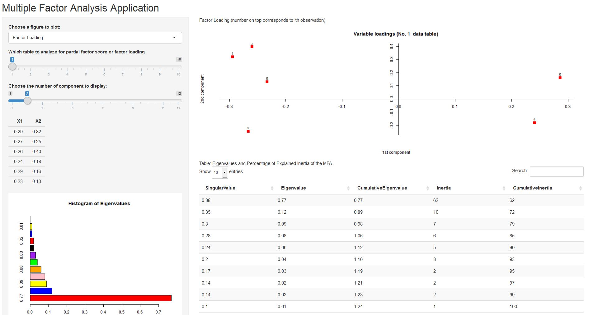

```{r setup, include=FALSE}
knitr::opts_chunk$set(echo = FALSE)
```

## About the presentation

In this presentation, we will briefly introduce the following things

- summary of the package tools
- a brief introduction of multiple factor analysis
- showcase of the package functionalities

## About MFA01 package

In this package, we created tools for multiple factor analysis (MFA), an extension of principle component analysis (PCA) to process multiple data sets and their correlations. The package include tools to compute the following outputs from MFA

- eigenvalues, common factor scores, partial factor scores, loadings
- visualization tools: generic functions for print, plot and tabularizing results
- auxiliary functions: _summaries of eigenvalues_, _contributions_, _$R_V$ coefficients_, _coefficients to study the between table structure_, _$L_q$ coefficients_ and _Bootstrap_ method to estimate the stability of the compromise factor scores.
- A shiny application

## What is MFA?

- Multiple factor analysis is a generalization of principle component analysis. 
- The goal of MFA is to "analyze several data sets of variables collected on the same set of observations, or—as in its dual version—several sets of observations measured on the same set of variables"
- MFA can be summarized into five steps, nicely illustrated by figure 1 by Abdi et al. (2013):
- Step 1: K tables of J_k variables collected on the same observations
- Step 2: Compute generalized PCA on each of the K tables (where ϒ is the first singular value of each table)
- Step 3: Normalize each table by dividing by its first singular value (ϒ)
- Step 4: Concatenate the K normalized tables
- Step 5: Compute a generalized PCA on the concatenated table

## What is MFA?




## What is MFA?




## How to install the package?

- To install the package, go to the R file 'install.R', use 'setwd()' to change the working directory to 'your_path/MFA01', and run the file.
- Then the MFA package should be installed. To create an 'mfa' object with default data set, simply run

```{r}
setwd("C:/Users/Sheng/Google Drive/Berkeley16Fall/STAT243/Stats-243/Stats-243/final")
library(MFA01)
mfa_obj <- MFA()
mfa_obj
```

## Functionalities

The mfa object computes the eigenvalues of the grand data table, which can be visualized by

```{r, eval = FALSE, echo = TRUE}
plot_eig(mfa_obj)
```


## Functionalities

A matrix of the common factor score can be accessed by

```{r,echo=TRUE}
mfa_obj$cfs
```

## Functionalities

Other elements of the mfa object include: 

```{r,echo=TRUE}
attributes(mfa_obj)$names
```

## Functionalities

To see a summary of what the object returns

```{r,echo=TRUE}
mfa_obj
```


## Eigenvalues

Our "ev.summary"" takes the "mfa" object and returns a table with the singular
values, the eigenvalues, cumulative, percentage of intertia, cumulative
percentage of inertia, for all the extracted components.

```{r,echo=TRUE}
setwd("C:/Users/Sheng/Google Drive/Berkeley16Fall/STAT243/Stats-243/Stats-243/final")
library(MFA01)
mfa_obj <- MFA()
data <- get(load("data/wine.rda"))
ev.summary(mfa_obj)
```

## Contributions

We include three functions to calculate _contributions_:
1. "ctr.obs": contribution of an observation to a dimension
1. "ctr.var": contribution of a variable to a dimension
1. "ctr.table": contribution of a table to a dimension

For instance, we call "ctr.obs" as follows:
```{r,echo=TRUE}
ctr.obs(mfa_obj)
```

## Coefficients to study the Between-Table Structure

To evaluate the similarity between two tables we can use the $R_V$ coefficient.

```{r,echo=TRUE}
table1=mfa_obj$assessors[[1]]
table2=mfa_obj$assessors[[2]]
RV(table1,table2)
```

## Coefficients to study the Between-Table Structure (Continued)

We can also get a matrix of $R_V$ coefficients by the following function.

```{r,echo=TRUE}
RV_table(data, sets = list(2:3, 4:5, 6:10))
```

## $L_g$ Coefficients

We design two functions for $L_g$ coefficients similar to $R_V$ coefficients.
```{r,echo=TRUE}
Lg(table1,table2)
Lg_table(data, sets = list(2:3, 4:5, 6:10))
```

## Bootstrap

We also write a function that allows the user to perform bootstrapping in order
to estimate the stability of the compromise factor scores.
```{r,echo=TRUE}
bt <- bootStrap(mfa_obj)
bt$mean
```

## Bootstrap (Continued)

```{r,echo=TRUE}
bt$sd
```

## Shiny App

The interface of the app looks like



One can use the drop down list to choose which plot to show and slide the number bar to choose which table to plot the partial factor scores and laoding.

